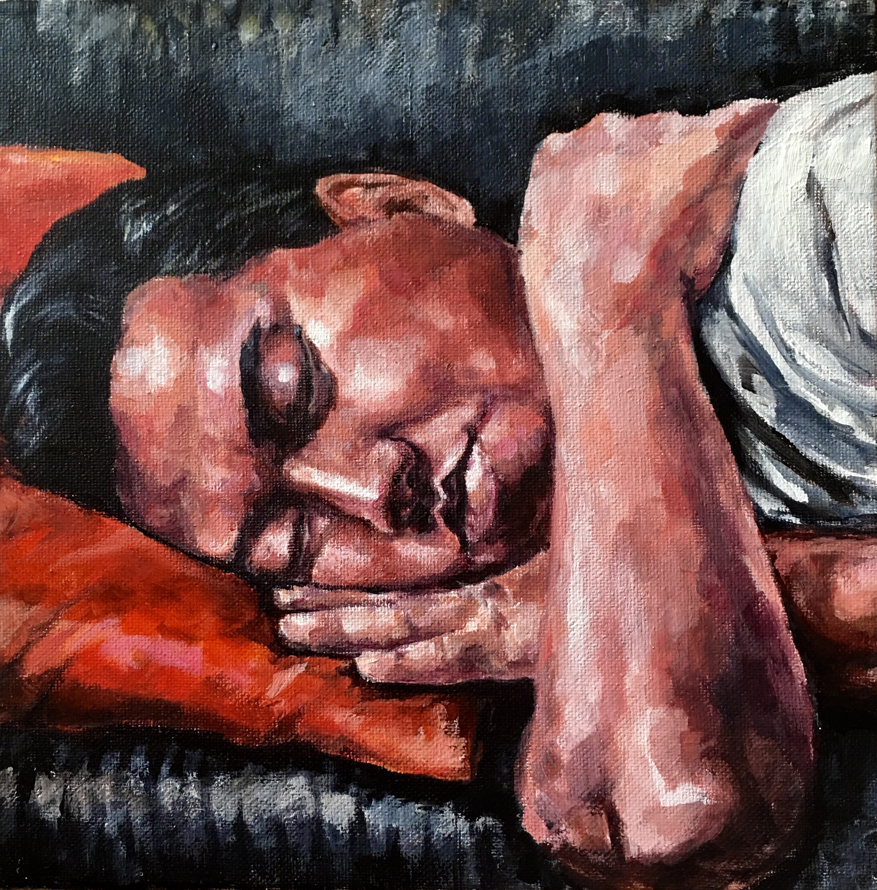

  

    
    
<b>childhood bedroom.</b>  graphite and colored pencil on bristol board.

  

  

    
    
<b>schoolbus.</b>  digital paint (heavypaint).

  

  

    
    
<b>henry.</b>  acrylic on canvas.

  

  

    
    
<b>phil.</b>  digital paint (clip studio paint).

  

  

    
    
<b>frog dissection.</b>  colored pencil on bristol.

  

  

    
    
<b>poggy.</b>  digital paint (heavypaint).

  

 
